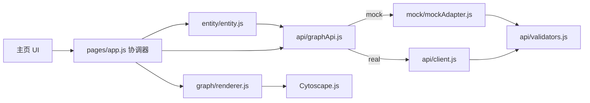

# GraphAgent 仓库分析报告

> 分析日期：2026-09-03  
> 分析对象：`wuziyang1/GraphAgent`，本地 `main` 分支，提交 `c320c20`  
> 分析方法：静态代码审阅、Git 历史检查、JavaScript 语法检查、JSONL 全量数据统计

## 1. 结论摘要

GraphAgent 当前处于**课程项目的前端原型与数据准备阶段**，尚不是一个完整的“智能体驱动的知识图谱自动构建系统”。仓库已经具备：

- 一份满足名义规模要求的医学文本数据集：3,000 条、100 个疾病类别、每类 30 条；
- 一个可离线运行的知识图谱可视化首页，支持 Mock 图谱浏览、搜索、实体/关系详情和邻域展开；
- 一份较完整的 REST API v1 契约，以及前端响应校验层；
- 面向 3,000+ 节点的“概览 + 按需展开”设计思路。

但项目要求中的关键闭环尚未出现：**没有数据采集程序、没有实体/属性/关系抽取代码、没有 Agent 编排、没有后端 API、没有图数据库或知识库存储、没有由这 3,000 条医学文本生成的真实图谱文件、没有自动化测试，也没有展示 PPT**。当前首页展示的是 48 个通用 AI 领域 Mock 实体和 71 条 Mock 关系，与医学数据集没有连接。

因此，若按“可演示前端”评价，完成度较高；若按项目题目所述的端到端系统评价，仍处于早中期，主要工作量在后端与数据流水线。

## 2. 仓库概况

### 2.1 目录与规模

```text
GraphAgent/
├── data/
│   └── r_medical_real_texts_3000.jsonl   # 3,000 条医学数据
├── docs/
│   ├── api.md                             # REST API v1 契约
│   └── data_collection_readme.md          # 数据来源与字段说明
├── frontend/
│   ├── index.html                         # 已实现的图谱浏览首页
│   ├── pages/                             # 独立搜索页、实体页（均为骨架）
│   ├── js/                                # API、Mock、图渲染、实体交互
│   ├── css/base.css
│   └── vendor/cytoscape.min.js
└── 项目要求.txt
```

代码规模（不含第三方压缩库）：

| 类型 | 文件数 | 行数 |
| --- | ---: | ---: |
| JavaScript | 15 | 2,234 |
| CSS | 1 | 363 |
| HTML | 3 | 226 |
| JSONL 数据 | 1 | 3,000 条 / 1.59 MB |

仓库共有 13 个提交，贡献记录显示 2 位作者；提交主要集中在 2026-09-01 至 2026-09-02。根目录缺少 README、LICENSE、依赖清单、CI 配置和测试目录。

### 2.2 当前技术栈

- 前端：HTML、CSS、原生 JavaScript；
- 图可视化：Cytoscape.js 3.30.4，本地 vendored 文件优先，CDN 作为回退；
- 数据交换：约定为 JSON REST API，统一 `{code, message, data}` envelope；
- 当前运行数据：前端内置 Mock；
- 后端、数据库、LLM/NLP 框架：尚未选型或实现。

## 3. 架构分析

### 3.1 已实现的前端架构



前端采用全局 `window.KG` 命名空间和经典 `<script>` 顺序加载。虽然没有模块构建工具，但职责划分清楚：

- `config.js`：运行模式、后端地址、超时和节点上限；
- `client.js`：唯一真实网络出口，处理 URL、超时、JSON envelope 和统一错误；
- `graphApi.js`：Mock/真实请求分流；
- `validators.js`：校验并规整后端数据，过滤悬空边和坏条目；
- `renderer.js`：封装 Cytoscape，负责布局、选中、缩放、筛选和增量并图；
- `entity.js`：搜索四态、实体详情、关系详情及竞态保护；
- `app.js`：初始化与模块协调。

这种分层适合课程项目：结构直观、零构建依赖、断网可演示。`graphApi.js` 使 UI 不感知 Mock/真实后端差异，`validators.js` 又把接口漂移隔离在 API 层，是当前代码最成熟的部分。

### 3.2 目标架构与实际缺口

项目题目隐含的完整链路应为：

```text
数据源 → 采集/清洗 → Agent 编排 → 实体/属性/关系抽取
     → 去重与实体消歧 → 三元组质检 → 图数据库/知识库
     → REST API → 可视化与查询
```

当前仓库只覆盖了链路两端的“静态数据文件”和“Mock 前端”。中间所有生产环节均缺失。因此仓库名中的 `Agent` 目前没有对应实现，真实医学数据也没有进入可视化图谱。

## 4. 数据集分析

对 `data/r_medical_real_texts_3000.jsonl` 逐行解析后的结果：

| 指标 | 实测结果 |
| --- | ---: |
| 可解析记录 | 3,000 |
| `major_class` | 全部为 `R` |
| 类别数 | 100 |
| 每类记录数 | 最少 30、最多 30 |
| 谓词数 | 20 |
| `fact_type` 数 | 20 |
| 空文本 | 0 |
| 必需字段缺失次数 | 0 |
| `object = null` | 1,000（33.3%） |

高频谓词主要为“相关症状”757 条、“检查项目”316 条、“所属分类”283 条、“治疗方式”201 条、“就诊科室”180 条和“并发疾病”169 条。数据规模严格满足“100 类、3,000 条”的最低要求。

需要注意：

1. 数据来自已有开源医疗知识图谱 `QASystemOnMedicalKG` 的结构化 `medical.json`，本仓库没有保留采集/转换脚本，难以复现 100 类 × 30 条的选择和生成过程。
2. 约三分之一记录的 `object` 为 `null`，主要是简介、病因、预防等描述型事实。直接把 `subject/predicate/object` 导入三元组会产生空客体，必须定义文本实体化、属性化或文档节点策略。
3. 数据说明中的示例与实际文件有漂移：示例把 `source_category` 写成数组，实际是字符串；示例中的 `fact_type`/`object` 也与实际首条记录不一致。
4. 数据已有 `subject`、`predicate` 等标签，适合构图或做弱监督基准，但不能单凭它证明系统完成了“自动信息抽取”。应保留一条从原始 `text` 到预测三元组的可复现流水线和评测结果。
5. 仓库没有 LICENSE，也未说明上游数据许可证、再分发条件、版本/提交哈希与医疗数据免责声明，存在复现和合规风险。

## 5. 前端与 API 质量

### 5.1 做得好的部分

- **可独立演示**：默认 Mock 模式，本地 Cytoscape 副本支持断网环境；
- **接口契约清晰**：7 个 GET 接口、分页、错误码、数据结构和大图限制均有书面定义；
- **错误处理完整**：超时、网络失败、非 envelope 响应和业务错误统一转为 `ApiError`；
- **防御性校验**：对重复节点、悬空边、缺失字段和类型错误有降级策略；
- **交互闭环较完整**：主页包含搜索、定位、高亮、详情、关系查看、双击展开、筛选和状态栏；
- **考虑竞态**：搜索序号和当前实体 ID 防止旧异步响应覆盖新状态；
- **安全意识尚可**：动态 HTML 主要通过 `escapeHtml` 转义，API 参数通过 `encodeURIComponent` 处理。

### 5.2 主要问题

#### P0：阻止项目形成完整闭环

1. **缺少后端与知识库**：`docs/api.md` 描述的 7 个接口均没有服务端实现。
2. **缺少 Agent/抽取流水线**：没有任何模型调用、提示词、工具编排、任务状态、重试或评估逻辑。
3. **医学数据与前端脱节**：主页 Mock 是 AI/计算机科学主题的 48 节点图，并非 `r_medical_real_texts_3000.jsonl` 的输出。
4. **缺少真实图谱产物**：没有规范化实体表、关系表、三元组 JSON/CSV、数据库导入文件或图数据库快照。
5. **缺少要求中的 PPT**。

#### P1：功能与正确性风险

1. **独立页面未完成**：`pages/search.html` 和 `pages/entity.html` 及其脚本只是 TODO 骨架。
2. **独立页面缺少校验器脚本**：两个页面没有加载 `api/validators.js`。一旦按计划调用 `KG.api.graph.*`，`graphApi.js` 会访问未定义的 `KG.api.validators`，直接报错。
3. **关系统计可能误导**：主页实体详情只请求 `page_size: 50`，随后用这一页的数据计算出边、入边和关联实体数量；关系超过 50 时，展示数量不是全量数量。`getEntity()` 返回的 `stats` 没有被用于显示。
4. **Mock 与 API 契约不完全一致**：文档要求非法 `limit/depth/page_size/direction` 返回 40001/40002；Mock 实现多处直接截断或回退，非法 `direction` 甚至按 `both` 处理。这削弱了 Mock 作为契约测试替身的价值。
5. **累计节点上限没有落实**：`setData()` 会将单次数据截断到 500 节点，但 `mergeData()` 多次展开时不检查画布累计节点数，可能突破 `GRAPH_MAX_NODES`。
6. **实体详情错误链不理想**：实体基本信息请求失败后，Promise 链仍继续请求关系，产生无意义请求，也可能让右栏同时出现不同阶段的错误状态。
7. **没有测试**：语法虽通过 `node --check`，但无单元测试、契约测试、端到端测试、性能基准或 CI。

#### P2：工程化与维护性问题

1. 根目录没有 README，首次访问者无法快速理解项目状态、启动方式和团队分工。
2. 没有 LICENSE、版本发布、变更日志和上游数据版本锁定。
3. 全局命名空间与脚本加载顺序成本较低，但模块增多后容易出现隐式依赖；例如独立页面漏引 `validators.js` 已体现该风险。
4. Cytoscape 压缩文件直接入库，但未提供第三方许可清单或完整性校验。
5. URL/localStorage 可覆盖任意 API 地址，适合联调，但正式部署应通过 CSP、允许域配置和 HTTPS 约束降低误配置风险。

## 6. 与项目要求的逐项对照

| 项目要求 | 当前状态 | 判断 |
| --- | --- | --- |
| 100+ 类别、3,000+ 条 R 类文本 | 100 类、3,000 条 | 已达到最低线 |
| 自动数据采集 | 只有结果与来源说明，无采集脚本 | 未完成/不可复现 |
| 实体、属性、关系自动识别 | 数据含上游标签，无本项目抽取实现 | 未完成 |
| 智能体系统 | 无 Agent 代码或运行轨迹 | 未完成 |
| 结构化三元组 | 部分记录可映射，1,000 条 object 为空 | 部分具备原料 |
| 存入知识库 | 无数据库与导入逻辑 | 未完成 |
| 图谱浏览 | 主页 Mock 浏览已实现 | 已完成原型 |
| 实体查询 | 主页轻量搜索已实现；独立页未实现 | 部分完成 |
| 关系展示 | 主页 Mock 关系展示已实现 | 已完成原型 |
| 完整源代码 | 只有数据与前端 | 未完成 |
| 生成的知识图谱数据文件 | 无 | 未完成 |
| 项目展示 PPT | 无 | 未完成 |

## 7. 推荐实施路线

### 第一阶段：先打通最小真实闭环

1. 定义规范化数据模型：`Document`、`Entity`、`Relation`、`Evidence`、`ExtractionRun`；每条关系保留来源记录 ID、原文证据、抽取方法、置信度和模型版本。
2. 编写可复现的 `ingest` 脚本，对 JSONL 做 schema 校验、清洗和哈希去重；固定上游仓库提交与许可证信息。
3. 针对 20 种事实类型建立规则基线，把非空 `object` 记录先转成三元组；对描述型空客体记录明确采用“实体属性”还是 LLM 二次抽取。
4. 输出真实图谱文件，例如 `artifacts/entities.jsonl`、`artifacts/relations.jsonl`、`artifacts/evidence.jsonl`，先用 SQLite 建最小知识库即可；若需要图查询再接 Neo4j。
5. 用 FastAPI（或团队熟悉的等价框架）实现现有 7 个接口，让主页切到 `API_MODE=real` 后展示医学图谱。

### 第二阶段：实现真正的 Agent 流程

建议把“智能体”限定为可解释、可恢复的工作流，而不是一个无限循环对话体：

- Planner：根据记录的 `fact_type` 选择规则抽取或 LLM 抽取；
- Extractor：输出符合 JSON Schema 的实体、属性、关系；
- Resolver：名称规范化、别名合并和实体消歧；
- Critic/Validator：检查空实体、非法关系、自环、证据缺失和置信度；
- Writer：幂等写库，记录运行 ID 与失败原因；
- Reporter：汇总处理量、失败率、实体/关系规模和质量指标。

每一步应可单独重跑，并把状态落盘。这样既能体现 Agent 编排，也便于答辩解释和故障恢复。

### 第三阶段：质量评测与产品收尾

1. 从 20 类关系中分层抽样制作人工标注集，报告实体识别与关系抽取的 Precision/Recall/F1，而不只报告记录数。
2. 增加数据、API 和 UI 三层测试；至少覆盖坏 JSON、重复 ID、空客体、分页边界、非法参数、悬空边和连续展开上限。
3. 完成独立搜索页和实体页，并修复脚本依赖与分页统计。
4. 增加根 README、LICENSE/第三方声明、`.env.example`、一键启动脚本和架构图。
5. 基于真实运行结果制作 PPT：问题、架构、Agent 流程、数据规模、抽取质量、图谱示例、演示路径和局限性。

## 8. 建议的近期优先级

最有价值的下一步不是继续打磨 Mock UI，而是完成一条可验证的真实路径：

```text
选取 100 条 JSONL
→ 自动抽取/规范化
→ 生成实体与关系文件
→ 写入数据库
→ 实现 7 个 REST 接口
→ 首页 real 模式展示医学图谱
```

该闭环跑通后再扩展到 3,000 条、增加 Agent 审核和指标评测。这样可以尽早暴露数据建模、空客体、实体消歧和接口性能问题，也能最快把当前优秀的前端原型转化为真正的 GraphAgent 系统。

## 9. 本次验证结果

- 15 个项目 JavaScript 文件全部通过 `node --check` 语法检查；
- JSONL 3,000 行全部可解析，类别数量与均衡性符合说明；
- 本次分析未修改业务代码，只新增本报告；
- 未进行浏览器端完整交互测试、真实 API 测试或抽取质量评测，因为仓库中尚无对应后端和测试基准。
